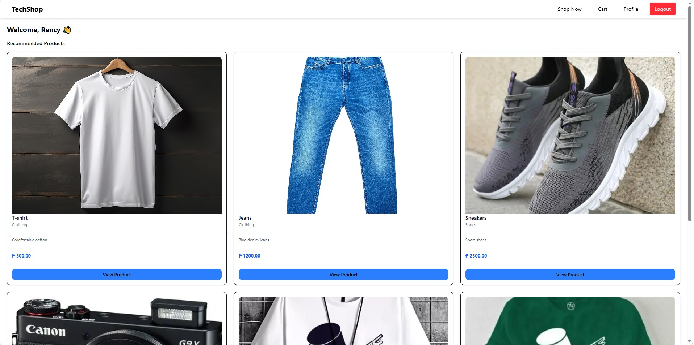
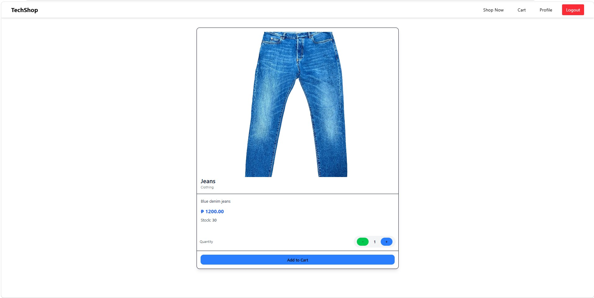
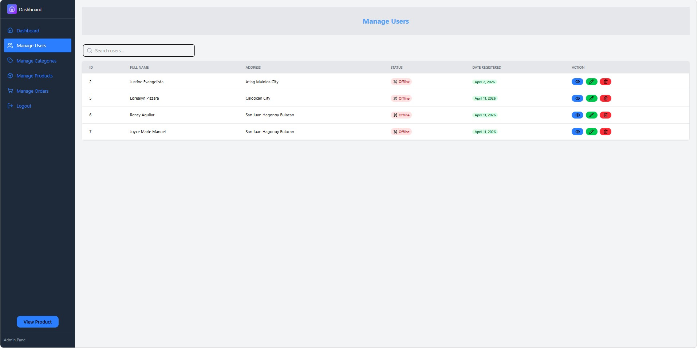
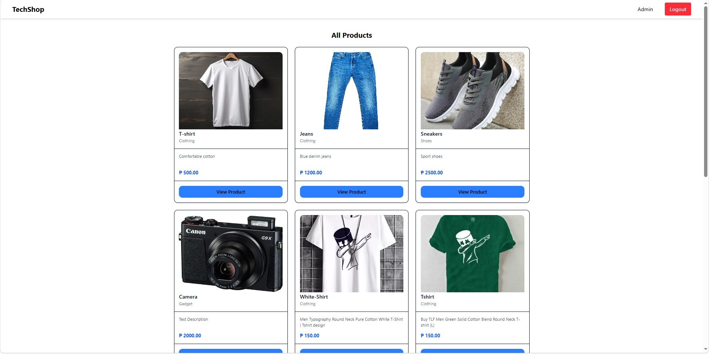

# 🛒 TechShop System (E-Commerce)

🚀 Full-stack e-commerce system with Admin Dashboard, JWT Authentication, and full CRUD functionality.

A full-stack e-commerce web application designed to handle secure authentication and role-based access.

This project showcases my ability to design and develop a full-stack web application using modern technologies.

---

## 🚀 Project Status

✅ Core Features Completed:

- Authentication (JWT)
- Role-based access (Admin/User)
- Product, Category, and User Management (CRUD)
- Add to Cart functionality

🚧 In Progress:

- Checkout system
- Order management

## 🧠 My Role

- Designed and developed the full frontend using React
- Built REST APIs using Node.js and Express
- Implemented authentication using JWT and bcrypt
- Designed and integrated MySQL database

---

## 🌐 System Features

### 🔓 Public Users (Not Logged In)

- Browse available products
- View product details
- ❌ Cannot add to cart or checkout without logging in

---

### 👤 Authenticated Users

- Browse products
- View product details
- Add items to cart
- Checkout orders
- Manage profile settings

---

### 🛠 Admin Panel

#### 👥 User Management

- View user information
- Update user details
- Delete users

#### 🗂 Category Management

- Add new categories
- View categories
- Update category details
- Delete categories

#### 📦 Product Management

- Add new products
- View product details
- Update product information
- Delete products

#### 📊 Dashboard

- Displays total users, products, orders, and revenue

---

## 📸 Screenshots

### 🌐 Public Pages

**🏠 Home Page**


**🛍 Product Listing**


**📄 Product Details View**


**ℹ️ About Page**


**📞 Contact Page**


---

### 🔐 Authentication

**🔑 User Login**


---

### 👤 User Pages

**🏠 User Home**


**🛒 Shop Page**


**📄 Product View**


**➕ Add to Cart**


**⚙️ Profile Settings**


---

### 🛒 Checkout

🚧 Currently under development — core functionality (cart, authentication, and order flow) is already implemented.

---

### 🛠 Admin Pages

#### 📊 Dashboard

**📊 Admin Overview Dashboard**


---

#### 👥 Manage Users

**📋 User Management Table**


**👁 View User Details**


**✏️ Update User**


**🗑 Delete User**


---

#### 🗂 Manage Categories

**📂 Category Management**


**➕ Add Category**


**👁 View Category**


**✏️ Update Category**


**🗑 Delete Category**


---

#### 📦 Manage Products

**📦 Product Management**


**➕ Add Product**


**👁 View Product**


**✏️ Update Product**


**🗑 Delete Product**


---

### 📦 Manage Orders

🚧 Planned feature — will include order tracking and admin order management.

---

### 🧾 Admin Viewing All Products

**📋 Admin Product List View**


---

## 🛠 Tech Stack

### 🎨 Frontend

- React JS (Vite)
- Tailwind CSS

### 📦 Frontend Dependencies

- react
- react-dom
- react-router-dom
- axios
- lucide-react

---

### ⚙️ Backend

- Node.js
- Express.js
- MySQL
- MVC Architecture

### 📦 Backend Dependencies

- express
- mysql2
- jsonwebtoken
- bcrypt
- cors
- dotenv
- nodemon
- chalk

---

## 📂 Project Structure

```id="final001"
ecommerce-app/
│
├── client/   # React + Vite frontend
├── server/   # Node.js + Express backend
```

---
